# Hey, I'm Lucien 👋

**Staff Fullstack Software Developer** | Remote Engineering Leader | Building scalable web platforms since 2014

I architect and drive technical strategy for enterprise-grade applications, leading teams to deliver high-impact solutions that serve millions of users. With 10+ years of remote work experience, I specialize in building performant, accessible, and maintainable systems that scale.

## 🎯 What I Do

- **Technical Leadership**: Drive architecture decisions, establish engineering standards, and mentor teams across multiple product lines
- **Fullstack Architecture**: Design and implement scalable systems using TypeScript, React, Node.js, Angular, and modern web technologies
- **Remote Engineering**: 7+ years of remote work experience (since 2018), collaborating effectively across distributed teams and time zones
- **Accessibility Champion**: Establish WCAG compliance standards and build accessibility-first engineering practices
- **Strategic Modernization**: Lead large-scale migrations and technical initiatives that improve performance, maintainability, and team velocity

## 🛠️ Tech Stack

**Languages & Frameworks**
`TypeScript` `JavaScript` `C#` `Ruby` `HTML/CSS`

**Frontend**
`React` `Angular` `Vue.js` `Web Components` `Next.js`

**Backend & Tools**
`Node.js` `.NET Core` `Ruby on Rails` `GraphQL` `REST APIs`

## 📊 GitHub Stats

## 🚀 Current Focus

- Driving frontend architecture at **GoTo** for enterprise collaboration products
- Building scalable Web Component libraries that serve millions of users
- Championing engineering excellence through mentorship and technical leadership
- Contributing to open source and the web development community

## 💼 Experience Highlights

**Staff Frontend Developer @ GoTo** _(Apr 2025 - Present)_ • Remote
Leading frontend technical strategy and establishing architectural patterns across product teams

**Senior Frontend Developer @ Shopify** _(Jun 2021 - Mar 2025)_ • Remote
Built mission-critical e-commerce features serving millions of merchants globally, integrated Shopify Magic AI capabilities, and led modernization of legacy systems

**Senior Frontend Developer @ LogMeIn (GoTo)** _(Oct 2018 - Jun 2021)_ • Remote
Architected cross-product Web Component library and led framework migration initiatives

## 🌐 Let's Connect

- 💼 [LinkedIn](https://www.linkedin.com/in/lbenie/)
- 🌍 [lbenie.me](https://lbenie.me) - Portfolio & Blog (EN/FR)
- 📧 Open to interesting opportunities and technical discussions

---

**Currently:** Helping engineering teams build better web experiences through technical leadership and architectural excellence.

**Based in:** Sherbrooke, QC, Canada 🇨🇦 | **Working:** 100% Remote since 2018 🌍
